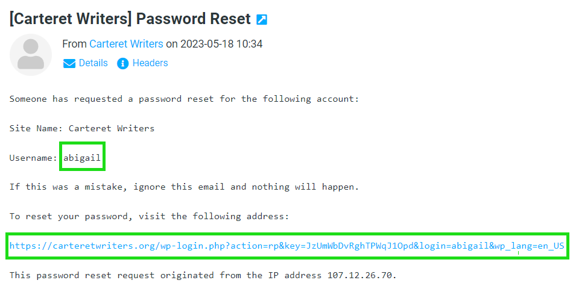

# Password Reset

## Table of Contents
- [Introduction](#introduction)
- [Prerequisites](#prerequisites)
- [Task 1: <Send Password Reset>](#task-1-password-reset)
- [Task 2: <Check Email>](#task-2-check-email)
- [Task 3: <Reset Password>](#task-3-reset-password)
- [Task 4: <Login With New Password>](#task-4-login-with-new-password)
- [Troubleshooting](#troubleshooting)
- [FAQ](#faq)
- [Resources](#resources)
- [Conclusion](#conclusion)

## Introduction
Everyone forgets their password every now and then. In aniticipation of that there is a process to restore the password.

## Prerequisites
This is what you'll need to accomplish these tasks:
- Access to the internet.
- Access to whatever email you use for Carteret Writers.
- A new password you'd like to set.

## Task 1: <Send Password Reset>
### Objective
Reset your password and login to Carteret Writers.

### Step 1
Use the login link on https://carteretwriters.org or [this link](https://carteretwriters.org/wp-login.php) to go to the login page. Locate the "Lost your password" link and click on it.

### Step 2
Enter your email address or username in the box provided and click the "Get New Password" button.

You will see a confirmation screen if all went well.

## Task 2: <Check Email>
Check your email for the message that was just sent and click on the link. Take note of your username.

## Task 3: <Reset Password>
A web browser will open and suggest a strong password. The regenerate button will suggest a different strong password. Either accept a suggestion or enter your the password of your choosing. Then click the "Save Password" button.

You will see a confirmation screen if all went well.

## Task 4: <Login With New Password>
Login using the new password just set and either the email address or the username that was noted in the email.

You should be taken to your profile page on the Carteret Writers website.

## Troubleshooting
As a user, there isn't much in the way of troubleshooting that can be done. The best bet is to email [Support](mailto:support@carteretwriters.org) and we can reset the password.

## FAQ
No Information yet.

## Resources
Wordpress Official Documentation can be found [HERE](https://wordpress.org/documentation/article/reset-your-password/) 

## Conclusion
Forgetting your password can be scary, but with a little patience you should be able to recover on your own. If that proves to be a little too chalenging, no worries, just [email support](mailto:support@carteretwriters.org) and we'll get it sorted for you.

---
